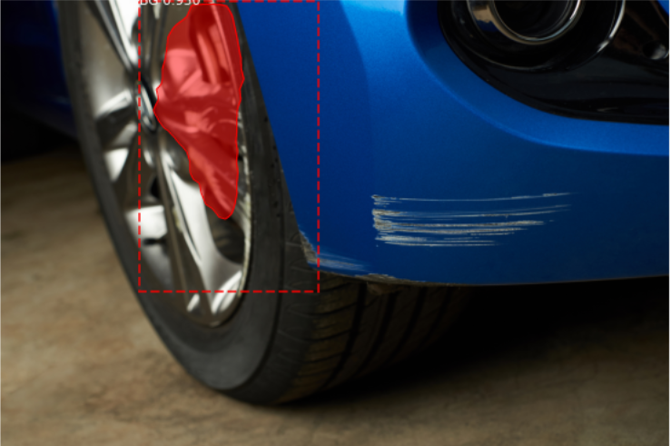
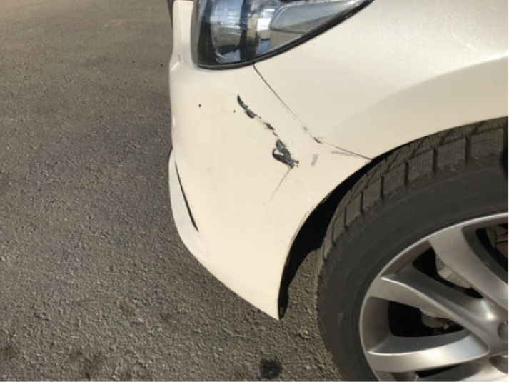

# Vehicle damage detection with Mask R-CNN
We are asked to create a jupyter notebook to train an image segmentation model for damage detection based on the given training data. The following repository provides an implementation of the [Mask R-CNN](https://github.com/matterport/Mask_RCNN). 

## Approach
### Model
Mask R-CNN is basically an extension of Faster R-CNN. Faster R-CNN is widely used for object detection tasks. For a given image, it returns the class label and bounding box coordinates for each object in the image. Faster R-CNN:
- first uses a ConvNet to extract feature maps from the images
- These feature maps are then passed through a Region Proposal Network (RPN) which returns the candidate bounding boxes
- We then apply a Rdgion of Interest (RoI) pooling layer on these candidate bounding boxes to bring all the candidates to the same size
- And finally, the proposals are passed to a fully connected layer to classify and output the bounding boxes for objects

In addition to pooling layer to find the RoI, Mask R-CNN generates also the segmentation mask. Once we have the RoIs based on the IoU values, we can add a mask branch to the existing architecture. This returns the segmentation mask for each region that contains an object. Basically, we predict the masks for all the objects in the image. 

Mask R-CNN can be thought as a combination of a Faster R-CNN that detects objects (class + bounding box) and a Fully Convolutional Network (FCN) that does pixel-wise boundary.

### Problem
We have 64 images (49 for training and 15 for validation) of damaged vehicles, already annotated with the proper polygon masks. 

In order to train Mask R-CNN model, I defined a custom Dataset class, appropriate to our case, overwriting some functions to loads images and annotations, adding them to my new dataset class. To evaluate our model, two additional functions are used to apply the color splash effect on the image on the damages, once they have been detected by our trained model. 

To reduce the training time of Mask R-CNN, I decided to: 
- train model for only 5 epochs;
- reduce number of steps per epoch to 50;
- change the backbone network to `resnet50`;
- exploit pre-trained weights on COCO dataset, and train only the heads of the model. 


## Requirements
The necessary requirements are specified in [requirements.txt](https://github.com/lucabnf/damage-detection/blob/master/requirements.txt). To run the following program on your own machine: 
1. Clone this repository
2. Install dependencies
   ```bash
   pip3 install -r requirements.txt
   ```
3. Run setup from the repository root directory
    ```bash
    python3 setup.py install
    ``` 
4. Download pre-trained weights on COCO dataset
   ```bash
   wget "https://github.com/matterport/Mask_RCNN/releases/download/v1.0/mask_rcnn_coco.h5"
   ```

The training, the evaluation and some studies on the dataset and on the final weights of the model are presented in the jupyter notebook [train_and_evaluate.ipynb](https://github.com/lucabnf/damage-detection/blob/master/train_and_evaluate.ipynb).

## Results


Some damage has been correctly identified on the right front wheel, but a major scratch on the lowest part of the frontal car body has not been detected.



No damage has been detected, even if it was easy to spot.

## Insights
The major drawback of this model is that it requires a lot of time to be properly trained. The performances of our model show that the asssumptions made in section "Problem" to reduce the training time have been proven to be a bit too optimistic. The fact that no damage was identified in the second picture may be partially justisfied considering that delta between background color and vehicle damage has lower magnitude with respect to the first image: this could results in gradients less "spiky" and thus, no clear convergence is reached (considering that is combined with a small number of epochs and steps per epoch). 

Although the model and its applications seem promising, a more deep and thourough training step (~ days) needs to be considered in order to make it behave well with unseen footage. Further experiments will be carried out in order to prove its validity.

## References
[Mask R-CNN](https://arxiv.org/abs/1703.06870). Kaiming He, Georgia Gkioxari, Piotr Dollár, Ross Girshick, 2017

[Mask R-CNN code](https://github.com/matterport/Mask_RCNN). Waleed Abdulla, 2017, Mask R-CNN for object detection and instance segmentation on Keras and TensorFlow
